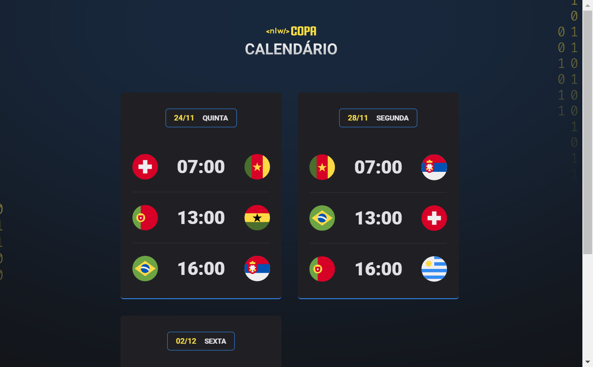

<h1 align="center"> Nlw - Copa </h1>

Projeto desenvolvido durante evento da Rocketseat

  <a href="#-tecnologias">Tecnologias</a>&nbsp;&nbsp;&nbsp;|&nbsp;&nbsp;&nbsp;
  <a href="#-projeto">Projeto</a>&nbsp;&nbsp;&nbsp;|&nbsp;&nbsp;&nbsp;
  <a href="#-layout">Layout</a>&nbsp;&nbsp;&nbsp;|&nbsp;&nbsp;&nbsp;
  <a href="#memo-licença">Licença</a>

  

  

 

  

## 🚀 Tecnologias

Esse projeto foi desenvolvido com as seguintes tecnologias:

- HTML e CSS
- JavaScript e JSON
- [Node e NPM](https://nodejs.org/)
- [Vite](https://vitejs.dev/)

## 💻 Projeto

Cartões da Copa do mundo 2022 disponibilizando informações sobre os jogos do Brasil e algumas outras seleções.
## 🔖 Layout

Você pode visualizar o layout do projeto através [DESSE LINK](https://www.figma.com/file/IwzVPovGpTGb8UGZEos4PJ/Calend%C3%A1rio-de-Jogos-(Community)?node-id=122%3A130). É necessário ter conta no [Figma](https://figma.com) para acessá-lo.

## :memo: Licença

Esse projeto está sob a licença MIT.

---
## 💜 Contato
Email:
rennanpereira.contato@gmail.com

Linkedin:
https://www.linkedin.com/in/rennan-santos-pereira/